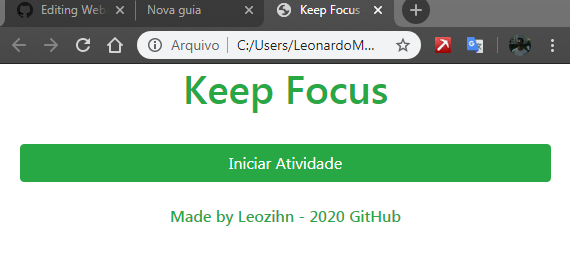
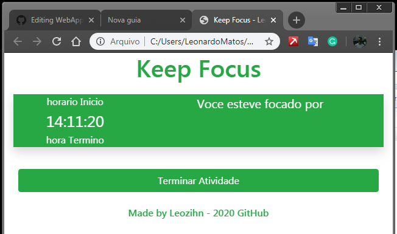
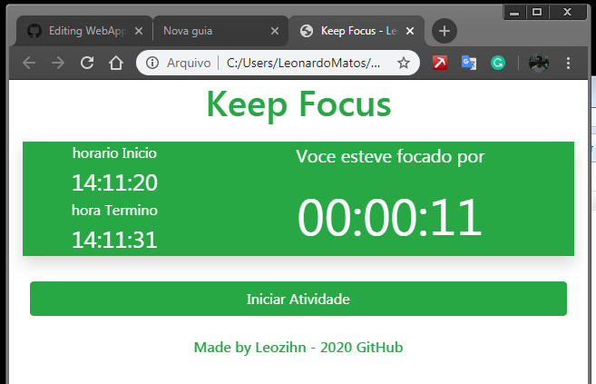
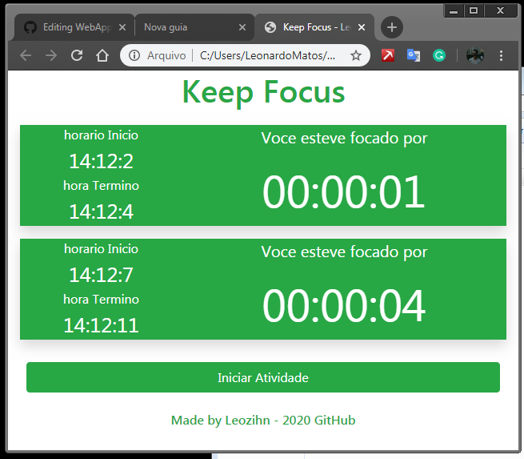

# WebAppKeepFocus
A web app to let you know how long you stay focused on some activity.
Made with bootstrap, html,css, javascript ...

1 - In the begin you just see that. 

2 - When you click in the button "iniciar atividade", the app create a card with some time informations.

3 - Then you click in "terminar Atividade", the app "close" the card. And return the more infomartions.

4 - You can open and close how many cards do you want.

